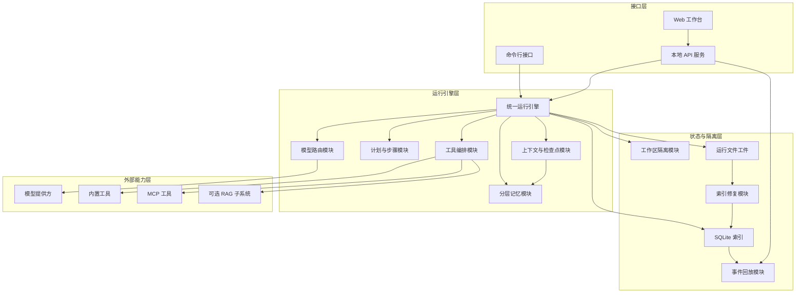
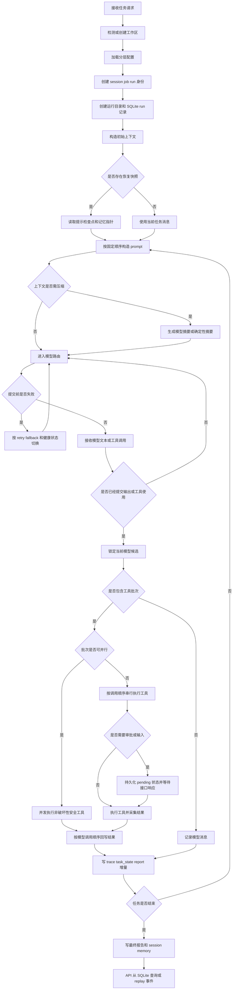

# 技术交底书

**案件名称**：一种本地优先状态化智能体运行时任务恢复与工具编排方法及系统

**技术联系人**：
- 姓名：待填写
- 电话：待填写
- 邮箱：待填写

**专利类型**：发明

---

## 注意事项

（1）交底书应使代理人能看懂，尤其是背景技术和详细技术方案，一定要写得全面、清楚、完整；
（2）技术的公开程度，应以本领域普通技术人员不需付出创造性劳动即可进行实施为准。
（3）在与代理人沟通时，对于代理人咨询的技术问题，应给予回答并认真讲解，并且按要求及时正确地补充相应技术材料。

## 一、介绍相关技术背景，描述与本发明技术最相近的现有技术，并说明该现有技术存在的缺点

### 1.1 现有技术

检索说明：在国家知识产权局专利公布公告系统及公开技术文档中，以“智能体运行时”“任务恢复”“工具编排”“模型路由”“提示压缩”“状态修复”“智能体检查点”“本地优先”等为主要检索词进行检索，并对相关公开文本和框架文档进行复核。

#### （1）智能体运行时安全检测与工具依赖图校验

CN122087822A 公开了一种智能体安全隐患检测方法、装置、设备、介质及产品。该方案针对输入文本、MCP 工具和推理链路进行安全检测：先判断输入文本的意图、困惑度和回译相似度，再基于待使用 MCP 工具的元数据确定工具安全类别，生成全局工具依赖图，并用图神经网络构建安全检测图，以验证工具依赖图是否可执行。

该类技术能够提高智能体工具调用前的安全检查能力，但其重点是安全隐患识别和依赖图可执行性验证，未公开本地优先状态层、文件工件与 SQLite 索引协同修复、提示检查点恢复、提交前模型路由和 API 事件回放的组合运行时方案。

来源链接：http://epub.cnipa.gov.cn/patent/CN122087822A

#### （2）场景化多轮问答中的工具编排

CN121765056A 公开了一种基于大语言模型的智慧园区多轮智能问答系统。该系统包括会话状态管理、权限投影、数据接入、证据构建、工具编排、大语言模型生成和可信度校验等模块；其中工具编排用于执行问答场景中的工具调用计划并获得执行结果。

该类技术适用于特定业务问答场景，强调权限过滤、证据包生成和答复可信度校验。其不足在于，未围绕通用智能体运行时公开工具 schema 的破坏性标注、批次并发判定、审批边界、确定性历史回写和可恢复任务快照之间的关联机制。

来源链接：http://epub.cnipa.gov.cn/patent/CN121765056A

#### （3）多智能体调度闭环中的工具编排

CN121704387A 公开了一种 LLM 中枢式多智能体工具编排与虚实闭环进化调度系统。该方案以 LLM 为调度中枢，结合实时多模态感知数据、知识图谱和历史任务案例，生成符合约束的决策方案，并驱动执行端形成感知、决策、执行、进化闭环。

该类技术主要面向物理执行场景中的多智能体协同调度，其关注点是业务决策方案和执行端闭环，未公开面向本地开发环境或通用任务工作区的文件状态工件、SQLite replay 索引、提示压缩检查点、工具审批和模型路由提交边界。

来源链接：http://epub.cnipa.gov.cn/patent/CN121704387A

#### （4）对话任务中断与恢复

CN121979478A 公开了一种对话任务管理方法、系统、车辆、存储介质及程序产品。该方案在车辆场景中使用任务栈管理多个对话任务：当用户发起新的第二对话任务时，中断第一对话任务并保存其任务信息；第二任务完成或检测到恢复指令时，从任务栈弹出任务信息并恢复第一任务。

该类技术能够解决车辆语音交互中的多对话任务切换问题，但恢复对象主要是对话任务栈，不涉及模型上下文 token 预算、工具结果历史、提示压缩摘要、事件序号、文件工件和索引可修复性，也未涉及重启后的 API 事件回放。

来源链接：http://epub.cnipa.gov.cn/patent/CN121979478A

#### （5）语言模型多模型路由

CN122021864A 公开了一种面向语言模型推理的多模型路由方法、装置和系统。该方案接收用户请求并进行任务分类，根据分类概率、置信度阈值和难度估计结果选择对应候选模型，并判断是否开启深度思考，以降低语言模型调用开销。

该类技术解决的是根据任务类型和难度选择合适模型的问题。本发明关注的是智能体运行副作用安全：当模型尚未产生用户可见文本或工具调用提交时，可以重试或切换模型；一旦出现用户可见输出或工具使用提交，就不再执行 fallback，从而避免重复输出、重复工具调用或状态不一致。

来源链接：http://epub.cnipa.gov.cn/patent/CN122021864A

#### （6）大语言模型提示压缩

CN120633874A 公开了一种大语言模型动态分级提示压缩方法、系统、装置和存储介质。该方案将提示压缩构造为马尔可夫决策过程，训练压缩智能体，在压缩比、输出对齐和信息保留之间进行奖励优化，以实现输入提示的动态压缩。

该类技术关注提示文本压缩算法本身。本发明不以新的压缩模型训练算法为重点，而是将摘要、保留尾部、计划状态、记忆指针、事件序号、token 估计和压缩降级状态组织成可恢复的运行时检查点，并在压缩失败时使用确定性摘要和熔断降级保持任务可续行。

来源链接：http://epub.cnipa.gov.cn/patent/CN120633874A

#### （7）通用状态修复与容错

CN121998001A 公开了一种分布式张量数据更新的合约递推方法。该方案通过动态合约集群、实时状态感知、递推更新、版本向量、冲突仲裁和预测补偿等手段，实现分布式张量更新中的容错与状态修复。

该类技术面向分布式机器学习中的张量状态一致性。本发明的状态修复对象是智能体任务运行工件和查询索引：以 trace、task_state 和 report 文件为事实来源，重建 SQLite 中的 job、run、event、report 和 task-state 元数据，并跳过损坏 trace 行，保证历史查询、回放和恢复基础仍可用。

来源链接：http://epub.cnipa.gov.cn/patent/CN121998001A

#### （8）公开智能体框架的持久化、状态和 tracing 能力

LangGraph 文档公开了通过 checkpointer 保存图状态、thread 和 checkpoint 的持久化能力，用于恢复或查看图执行状态。

来源链接：https://docs.langchain.com/oss/python/langgraph/persistence

AutoGen AgentChat 文档公开了 agent、team 和 termination condition 的状态保存与加载能力，状态可序列化到文件或数据库后再加载。

来源链接：https://microsoft.github.io/autogen/stable/user-guide/agentchat-user-guide/tutorial/state.html

OpenAI Agents SDK 文档公开了 agent、tool、handoff、guardrail 和 tracing 等构件，并可记录一次 agent run 中的 LLM generation、tool call、handoff 等事件。

来源链接：https://openai.github.io/openai-agents-python/tracing/

Google Agent Development Kit 文档公开了 session state 和 artifact 等概念，用于保存会话状态或较大工件。

来源链接：https://google.github.io/adk-docs/sessions/state/

来源链接：https://google.github.io/adk-docs/artifacts/

上述框架提供了智能体应用开发所需的持久化、状态或观测能力，但通常以图状态、agent/team 状态、tracing 或 session artifact 为中心。其不足在于未将本地工作区隔离、可读文件事实工件、SQLite 可重建索引、提示检查点、工具批次安全执行、提交前模型路由、审批/输入重启语义和 API SSE 事件回放组织为统一的本地优先状态化运行时方法。

### 1.2 现有技术存在的缺点

（1）状态持久化与可读调试难以兼得。现有方案常采用单一数据库或框架内部 checkpoint 保存运行状态，开发者难以直接读取和迁移；若仅写日志文件，又难以支持快速列表查询、事件回放、pending 审批/输入状态和重启后的历史 job 查询。

（2）长任务恢复容易丢失上下文结构。简单保存对话历史会导致上下文膨胀；简单截断历史又会丢失计划进度、工具结果、记忆引用和最后事件位置。现有提示压缩技术通常只关注压缩质量，而不直接解决运行时恢复。

（3）工具执行缺少副作用边界。智能体一次模型响应中可能包含多个工具调用。若全部串行，执行效率较低；若全部并行，可能绕过审批、引起写冲突或造成历史记录顺序不稳定。

（4）模型 fallback 与工具副作用容易冲突。语言模型路由方案往往从成本或质量角度选择模型，但智能体运行时还必须考虑用户可见输出和工具调用是否已经提交；一旦提交后再切换模型，可能造成重复工具执行或状态不一致。

（5）本地任务隔离不充分。开发型智能体通常需要读写文件、运行 shell、保存记忆和索引 RAG 工件；若没有工作区级隔离，不同任务之间容易发生文件、状态、记忆或配置污染。

（6）API 重启后的历史可见性不足。很多运行时把 live job、SSE buffer、审批通道和输入通道放在内存中，服务重启后历史事件和任务状态难以稳定查询，也难以向用户准确表达“运行中断”而不是“仍在运行”。

## 二、针对上述缺点，说明本发明所要解决的技术问题

本发明拟解决以下技术问题：

（1）如何在本地优先智能体运行时中，同时提供可读、可迁移的运行工件和可查询、可回放、可修复的索引状态。

（2）如何在长任务、多轮工具调用和上下文预算受限的情况下，形成可恢复的提示检查点，使续跑不依赖全量历史回放。

（3）如何根据工具安全属性和审批策略，在保证副作用可控的前提下提高批次工具执行效率，并保持历史和 trace 的确定性。

（4）如何在多模型或多提供方路由中定义提交边界，使 retry/fallback 只发生在尚未产生用户可见输出或工具使用提交之前。

（5）如何以工作区为边界统一隔离配置、状态、文件工具、shell、session memory 和 durable memory，降低多任务污染。

（6）如何在 API 服务重启后仍能查询历史 job 状态和 replay 历史事件，并对丢失的 live 审批/输入通道给出明确中断语义。

## 三、本发明技术方案的详细阐述

### 3.1 背景

本发明适用于本地优先的智能体运行环境。该环境可通过命令行、HTTP API 或 Web 工作台提交任务，并由统一的运行引擎执行模型调用、工具调用、计划步骤、审批、用户输入请求、记忆加载、上下文压缩和报告生成。

在一个典型实施例中，系统默认在本机绑定服务地址，并将运行状态写入当前工作区下的状态目录。系统可支持文件夹工作区、代码仓库工作区和独立任务工作区。独立任务工作区可被创建在预设任务基目录下，并将配置解析、文件工具边界、shell 工作目录、运行状态、session memory 和 durable memory 重定位到该任务工作区内。

本发明的核心思想是：将智能体任务视为具有可观测事件、可恢复上下文和受控副作用的状态化运行过程。系统一方面保存可读文件工件作为事实资产，另一方面维护 SQLite 索引用于查询、回放和重启恢复；在执行过程中，系统基于提示检查点和分层记忆构造上下文，基于工具安全标注控制批次并发与审批，基于提交边界控制模型 retry/fallback。

### 3.2 系统框图

图中接口层仅负责接收任务、提供交互和消费事件；运行引擎层负责统一的模型、工具、上下文、计划和记忆流程；状态与隔离层负责工作区边界、文件事实工件、SQLite 索引、修复和事件回放；外部能力层提供模型、工具和可选检索能力。

### 3.3 模块功能说明

（1）接口层：包括命令行接口、本地 API 服务和 Web 工作台。各接口层不直接维护运行时核心状态，而是构造任务请求、工作区请求、审批/输入响应和取消请求，并消费统一的运行事件流。

（2）工作区隔离模块：用于识别当前工作区类型。对于普通文件夹或代码仓库，系统将工作区根目录作为默认边界；对于独立任务工作区，系统在任务基目录下创建任务根目录，并将状态目录、文件工具边界、shell 工作目录、session memory 和 durable memory 绑定到该任务根目录。

（3）状态存储模块：用于保存文件工件和 SQLite 索引。文件工件包括追加式 trace、可恢复任务快照和最终报告；SQLite 索引用于保存 session、job、run、event、report、task-state metadata、pending approval、pending input 和 replay offset 等查询数据。

（4）索引修复模块：用于在索引缺失、损坏或迁移后，从文件工件重建 SQLite 索引。修复时以运行目录下的 trace、task_state 和 report 为事实来源；对于单行损坏的 trace，系统记录损坏行并跳过该行，而不终止整个修复流程。

（5）上下文与检查点模块：用于构造模型提示上下文并生成可恢复检查点。提示顺序为 system、durable memory、session memory、compact summary、recent history tail、current user message。检查点保存摘要、保留尾部、计划、记忆指针、最近步骤、事件序号、token 估计和压缩状态。

（6）分层记忆模块：包括 working memory、session memory 和 durable memory。working memory 参与当前 run 的 prompt；session memory 保存同一 session 的摘要；durable memory 保存跨 session 的稳定项目事实或长期偏好，并通过受控工具写入。

（7）模型路由模块：用于在主模型、备用模型或备用提供方之间进行提交前路由。模型调用过程中，系统探测首个可提交事件；若在提交前发生可重试错误或超时，可根据 retry/backoff、rate-limit retry-after 和健康状态尝试重试或 fallback；一旦发生用户可见文本或工具使用提交，系统停止 fallback。

（8）工具编排模块：用于根据工具 schema 的破坏性标注和并行安全标注决定执行策略。若同一批次内所有工具调用均非破坏性且并行安全，则并发执行；否则按模型给出的顺序串行执行，并在破坏性工具前进入审批边界。执行结果按模型调用顺序写回历史和 trace。

（9）审批与输入模块：用于处理破坏性工具审批和运行中用户输入。API 模式下，pending approval 和 pending input 在 live 期间写入索引用于展示和审计；服务重启后，无法重建的 live 答复通道被标记为 interrupted，并通过恢复新 run 继续任务。

（10）事件回放模块：用于从 SQLite 读取历史 event seq，并向 API 或 Web 工作台回放历史 SSE 事件。对于仍在运行的 job，系统同时结合 live broadcast；对于已中断或完成的历史 job，系统以持久索引为准提供查询和 replay。

（11）报告模块：用于在任务结束时生成最终报告。报告包含运行身份、工作区元数据、模型标识、最终状态、终止原因、步骤数、使用量、工具调用统计、最终输出和工具写入变更摘要。

（12）可选 RAG 子系统：在启用检索增强功能时，系统可在状态目录下保存索引、manifest、ingestion log 和 eval report，并通过工具 schema 暴露检索能力；未启用时，系统暴露带能力状态说明的 stub 工具。

### 3.4 系统流程说明

流程说明如下：

（1）系统接收任务请求后，首先确定工作区边界。若请求指定独立任务工作区，则系统创建或复用该任务工作区，并将配置、状态、工具和记忆路径重定位到该工作区。

（2）系统生成 session、job 和 run 身份，并在状态目录下创建 run 目录。系统将运行开始信息写入 SQLite，并创建追加式 trace writer。

（3）系统构造上下文。若存在恢复快照，则优先读取提示检查点中的摘要、保留尾部、计划、记忆指针和 last event seq；若无恢复快照，则使用当前任务消息和默认记忆加载结果。

（4）系统根据 token 预算判断是否需要压缩历史。当旧历史被主动移出活动 prompt 时，系统可请求当前模型生成恢复摘要；若模型摘要失败，系统生成确定性摘要，记录降级信息；连续失败达到阈值时，打开压缩降级熔断。

（5）系统进入模型路由。模型路由模块只在首个可提交事件之前进行 retry 或 fallback。可提交事件包括非空用户可见文本、工具使用开始或工具使用完成等。一旦发生可提交事件，后续错误直接返回，不再切换模型。

（6）当模型产生工具调用时，系统读取工具 schema。若同批次全部工具均非破坏性且并行安全，则并发执行；否则串行执行，并对破坏性工具发起审批。审批或输入等待状态在 live 期间写入索引，便于 API 查询。

（7）工具执行完成后，系统按模型原始调用顺序将工具结果写回对话历史，写入 trace，并更新 task_state。即使并发工具先后完成顺序不同，对模型历史和持久事件的顺序仍保持确定。

（8）任务结束时，系统写入最终 report，执行 session memory hook，并将 run 状态记录为完成、错误、取消或中断。API 可从 SQLite 查询历史状态并按 event seq 回放 SSE 事件。

（9）若服务重启，系统在启动时初始化 SQLite，并将仍处于 init 或 running 的历史 job/run 标记为 interrupted。对于 stale pending approval/input，系统也标记为 interrupted，而不伪造可回答的 live 通道；用户可基于最新 task_state 发起新的恢复 run。

### 3.4.1 符号与公式

#### （1）运行与状态符号

| 符号 | 含义 | 下标/量纲 |
|------|------|-----------|
| \(u\) | 用户提交的任务请求 | 单个请求对象 |
| \(w\) | 工作区对象 | \(w\) 可为文件夹、仓库或任务工作区 |
| \(r\) | 单次运行索引 | \(r=1,\ldots,R\) |
| \(k\) | 事件序号 | \(k=1,\ldots,K_r\) |
| \(e_{r,k}\) | 运行 \(r\) 的第 \(k\) 个事件 | 按 trace 和 SQLite event seq 排序 |
| \(F_r\) | 运行 \(r\) 的文件工件集合 | 包括 trace、task_state、report |
| \(D_r\) | 运行 \(r\) 的 SQLite 索引记录集合 | 包括 job、run、event、report、task-state 等 |
| \(C_r\) | 运行 \(r\) 的提示检查点 | 包括摘要、尾部、计划、记忆指针等 |
| \(S_r\) | 运行 \(r\) 的压缩摘要 | 字符串或空值 |
| \(T_r\) | 运行 \(r\) 保留的历史尾部 | 消息序列 |
| \(L_r\) | 运行 \(r\) 的最后事件序号 | 非负整数 |
| \(M_r\) | 运行 \(r\) 的记忆指针集合 | session memory 和 durable memory 路径 |

#### （2）工具与模型符号

| 符号 | 含义 | 下标/量纲 |
|------|------|-----------|
| \(G_b\) | 第 \(b\) 个工具调用批次 | \(b=1,\ldots,B\) |
| \(\ell\) | 工具调用索引 | \(\ell \in G_b\) |
| \(x_\ell\) | 第 \(\ell\) 个工具调用 | 包含名称、参数和调用标识 |
| \(d_\ell\) | 工具调用 \(x_\ell\) 的破坏性标记 | \(d_\ell \in \{0,1\}\) |
| \(s_\ell\) | 工具调用 \(x_\ell\) 的并行安全标记 | \(s_\ell \in \{0,1\}\) |
| \(a_\ell\) | 工具调用 \(x_\ell\) 的审批状态 | \(a_\ell \in \{0,1\}\)，1 表示已允许 |
| \(o_\ell\) | 工具调用 \(x_\ell\) 在模型输出中的顺序 | 正整数 |
| \(m\) | 模型候选索引 | \(m=1,\ldots,M\) |
| \(c_m\) | 模型候选 \(m\) 是否已提交输出或工具使用 | \(c_m \in \{0,1\}\) |
| \(h_m\) | 模型候选 \(m\) 的健康允许状态 | \(h_m \in \{0,1\}\) |
| \(n_m\) | 模型候选 \(m\) 的已尝试次数 | 非负整数 |
| \(N_{\max}\) | 单一模型候选的最大尝试次数 | 正整数 |
| \(I\) | 指示函数 | 条件成立为 1，否则为 0 |

#### （3）核心判定公式

工具批次并行执行判定如下：

\[
P(G_b)=I\left(\sum_{\ell \in G_b} d_\ell=0\right)\cdot I\left(\prod_{\ell \in G_b} s_\ell=1\right) \tag{1}
\]

式 (1) 中，当批次内不存在破坏性工具，且所有工具均标记为并行安全时，批次并行判定值为 1，系统可并发执行该批次；否则批次并行判定值为 0，系统按模型调用顺序串行执行，并对需要审批的工具进入审批边界。

模型候选的提交前可切换条件如下：

\[
A_m=I(c_m=0)\cdot I(h_m=1)\cdot I(n_m<N_{\max}) \tag{2}
\]

式 (2) 中，只有当模型候选尚未提交用户可见文本或工具使用、健康状态允许且尝试次数未达到上限时，系统才允许对该候选继续 retry 或进入 fallback。若模型提交标记为 1，即使后续发生流式错误，系统也不切换到其它模型候选。

提示检查点可表示为：

\[
C_r=\{S_r,T_r,L_r,M_r\} \tag{3}
\]

式 (3) 中，压缩摘要、保留历史尾部、最后事件序号和记忆指针集合共同构成提示检查点。恢复时系统优先根据提示检查点重建 prompt，再按需要读取文件工件集合和 SQLite 索引集合进行历史查询和事件回放。

索引修复关系如下：

\[
\widehat{D}_r=\mathrm{repair}(F_r,\{e_{r,k}\}_{k=1}^{K_r}) \tag{4}
\]

式 (4) 中，修复后的索引记录集合由文件工件和可解析事件重建得到。若个别事件解析失败，系统跳过该事件并继续处理其余事件，使修复过程不会因单行损坏而整体失败。

### 3.5 关键技术参数

| 参数名称 | 符号 | 含义 | 取值或约束 |
|----------|------|------|------------|
| 事件序号 | \(k\) | trace 与 SQLite replay 的事件顺序 | 正整数，按 run 内递增 |
| 文件工件集合 | \(F_r\) | 运行 \(r\) 的 trace、task_state、report | 至少包含可用于恢复的 task_state |
| SQLite 索引集合 | \(D_r\) | 查询和 replay 所需索引记录 | 可由 \(F_r\) 修复得到 |
| 提示检查点 | \(C_r\) | 恢复上下文的结构化检查点 | 包含 \(S_r,T_r,L_r,M_r\) |
| 压缩摘要 | \(S_r\) | 已移出活动 prompt 的历史摘要 | 可由模型生成或确定性生成 |
| 历史尾部 | \(T_r\) | 恢复时保留的最近消息 | 受 token 预算限制 |
| 最后事件序号 | \(L_r\) | 检查点对应的事件高水位 | 非负整数 |
| 记忆指针集合 | \(M_r\) | session memory 和 durable memory 路径 | 路径受工作区和配置约束 |
| 工具批次 | \(G_b\) | 同一模型响应中提出的一组工具调用 | 可包含一个或多个 \(x_\ell\) |
| 破坏性标记 | \(d_\ell\) | 表示工具调用是否可能写入、删除或执行高风险操作 | 0 或 1 |
| 并行安全标记 | \(s_\ell\) | 表示工具调用是否可与同批次其它调用并发 | 0 或 1 |
| 审批状态 | \(a_\ell\) | 表示破坏性工具是否获得允许 | 0 或 1 |
| 模型提交标记 | \(c_m\) | 表示模型候选是否已提交文本或工具使用 | 0 或 1 |
| 健康允许状态 | \(h_m\) | 表示候选提供方是否未处于打开熔断状态 | 0 或 1 |
| 已尝试次数 | \(n_m\) | 单一候选在当前请求内的尝试次数 | 非负整数 |
| 最大尝试次数 | \(N_{\max}\) | 单一候选允许的最大尝试次数 | 正整数 |
| 指示函数 | \(I\) | 条件成立时取 1，否则取 0 | 二值函数 |

## 四、与现有技术相比，本发明具有哪些优点？

（1）同时兼顾可读工件和高效索引。文件工件作为事实资产，便于调试、迁移和人工审查；SQLite 索引用于快速查询、事件回放和 API 状态展示，并可由文件工件重建。

（2）恢复语义更完整。提示检查点不仅保存摘要，还保存保留尾部、计划、记忆指针、事件高水位、token 估计和压缩状态，使恢复不依赖全量历史回放，也不只是简单截断。

（3）工具执行效率与副作用安全兼顾。系统允许非破坏性且并行安全的工具批次并发执行，同时对破坏性或不明安全性的工具串行执行并进入审批边界。批次结果按模型调用顺序写回，保证历史确定性。

（4）模型路由避免副作用重复。系统以“提交前”为路由边界，只在未产生用户可见文本或工具使用前 retry/fallback；一旦提交，系统锁定当前模型候选，避免半路切换造成重复输出或重复执行。

（5）工作区隔离降低任务污染。独立任务工作区将状态、文件工具、shell、记忆和默认配置路径绑定到任务根目录，适合本地多任务并行处理、临时任务清理和交付隔离。

（6）重启后状态表达更准确。系统把历史 job、run、event、report 和 pending 状态写入索引；服务重启后将遗留运行状态标记为 interrupted，而不是伪装为仍可回答，从而提高系统可运维性和用户理解一致性。

（7）适配多接口但核心语义一致。命令行、API 和 Web 工作台均消费同一运行引擎事件和状态层，不会形成三套互相割裂的任务生命周期。

## 五、本发明的技术关键点和欲保护点是什么？

（1）一种本地优先状态化智能体运行方法。该方法包括：确定工作区边界；生成 session、job、run 身份；创建运行文件工件和 SQLite 索引记录；构造含分层记忆与提示检查点的模型上下文；执行提交前模型路由；根据工具安全标注执行批次工具；按模型调用顺序写回工具结果；持续写入 trace、task_state 和 report；在恢复或重启后基于检查点和索引继续查询、回放或续跑。

（2）一种文件工件与 SQLite 索引协同的状态管理方法。该方法将 trace、task_state、report 保存为可读文件事实工件，同时在 SQLite 中维护 session、job、run、event、report、task-state metadata、pending approval/input 和 replay offset；当索引缺失或损坏时，从文件工件重建索引并跳过损坏 trace 行。

（3）一种提示检查点恢复方法。该方法按 system、durable memory、session memory、compact summary、recent history tail、current user message 的顺序构造 prompt，并在检查点中保存摘要、保留尾部、计划、记忆指针、最后步骤、最后事件序号、token 估计和压缩状态；当模型摘要失败时使用确定性摘要并记录降级或熔断信息。

（4）一种工具批次执行控制方法。该方法为工具 schema 设置破坏性标记和并行安全标记；仅当同一批次所有工具非破坏性且并行安全时并发执行；对破坏性、未知、shell、写文件、memory write 和 request_input 类工具串行执行并按策略审批；执行结果按模型调用顺序回写历史和 trace。

（5）一种提交前模型路由方法。该方法对模型候选进行首个可提交事件探测；在未提交用户可见文本或工具使用前，依据错误类型、重试次数、退避参数、rate-limit retry-after 和健康熔断状态进行 retry 或 fallback；提交后禁止切换候选模型。

（6）一种任务工作区隔离方法。该方法支持将独立任务工作区创建在任务基目录下，并将配置解析、状态目录、文件工具边界、shell 工作目录、session memory、durable memory 和可选 RAG 工件路径统一重定位到任务根目录。

（7）一种 API 事件回放和中断标记方法。该方法在 API 启动时初始化索引，将历史 init 或 running 状态标记为 interrupted；通过 SQLite event seq 回放历史 SSE 事件；对重启后无法重建 live 通道的 pending approval/input 标记为 interrupted，并允许基于最新 task_state 新建恢复 run。

（8）一种智能体运行时系统。该系统包括接口层、工作区隔离模块、状态存储模块、索引修复模块、上下文与检查点模块、分层记忆模块、模型路由模块、工具编排模块、审批与输入模块、事件回放模块和报告模块，各模块按第三章所述流程协同工作。

## 六、其它

### 6.1 实施例一：本地命令行任务的可恢复执行

用户在本地代码仓库中提交一个代码修改或文档整理任务。系统检测到当前目录存在代码仓库边界，将仓库根目录作为工作区根，并在该根目录下创建状态目录。系统生成新的 session、job 和 run 身份，创建运行目录，开始写入 trace。

运行过程中，模型先读取文件，再请求写入某个文档。读取工具被标记为非破坏性且并行安全，可与其它非破坏性读取并发执行；写入工具被标记为破坏性，系统根据审批策略等待用户确认。写入完成后，工具结果和变更摘要按模型调用顺序写回历史，并写入 task_state。

若任务中途达到上下文软限制，系统对较旧历史生成摘要，保留最近消息尾部和计划进度，形成提示检查点。用户随后通过 sessions 命令列出可恢复任务，并选择最新任务继续。系统优先使用提示检查点重建上下文，而不把全量历史直接塞回模型。

### 6.2 实施例二：API 服务重启后的历史查询与续跑

用户通过本地 API 创建任务，并通过 Web 工作台观看 SSE 事件流。任务执行到等待审批时，系统将 pending approval 写入 SQLite，并通过事件流通知前端。若此时 API 服务重启，live 审批通道丢失。

服务重新启动后，系统初始化 SQLite，将仍处于 running 的 job 标记为 interrupted，并将 stale pending approval 标记为 interrupted。用户重新打开 Web 工作台时，仍可查询到该 job 的历史事件和中断状态。若用户选择恢复，系统读取最新 task_state，创建新的 run，并基于检查点继续执行。

### 6.3 实施例三：提交前模型 fallback

系统配置主模型和一个备用模型。某次模型调用中，主模型在输出任何非空文本或工具使用事件前返回可重试错误。系统根据退避参数等待后重试；若仍失败，则尝试备用模型。备用模型产生第一个非空文本后，系统视为提交，后续即使流式传输发生错误，也不会再切换回其它模型，以避免同一任务出现两个模型片段交叉输出。

若主模型首先产生工具使用开始事件，则系统同样视为提交。此后即便工具使用流后续中断，也不会 fallback 到备用模型重新发起同一工具调用，从而避免重复执行工具。

### 6.4 实施例四：独立任务工作区

用户通过命令行或 API 指定一个任务工作区名称。系统在任务基目录下创建独立任务目录，并将默认状态目录、shell 工作目录、文件读写边界、session memory 和 durable memory 全部绑定到该目录。任务完成后，用户可直接删除任务目录，以移除该任务的输入文件、运行状态和默认记忆，不影响主代码仓库或其它任务。

### 6.5 参数设置示例

在一个实施例中，系统可将本地 API 默认绑定到本机回环地址；远程绑定时要求配置 token，除非显式设置不安全远程模式。工具 shell 的超时时间、最大输出字节数、环境继承和命令 denylist 可通过配置给出。上下文预算可包括 soft limit、hard limit 和 reserved budget；压缩连续失败阈值可设置为若干次。上述数值用于说明可实施方式，不作为权利要求保护范围的限制。

### 6.6 技术效果

通过上述方案，系统能够在本地开发和自动化任务场景下实现以下效果：

（1）任务状态可人工审查，也可由索引快速查询和 replay；
（2）长任务可通过检查点恢复，减少全量历史回放导致的上下文膨胀；
（3）工具执行在安全可控前提下获得批次并发能力；
（4）模型 fallback 不会跨越已提交副作用边界；
（5）独立任务工作区减少任务间状态、文件和记忆污染；
（6）API 重启后的历史状态和中断语义明确，便于用户继续处理。
